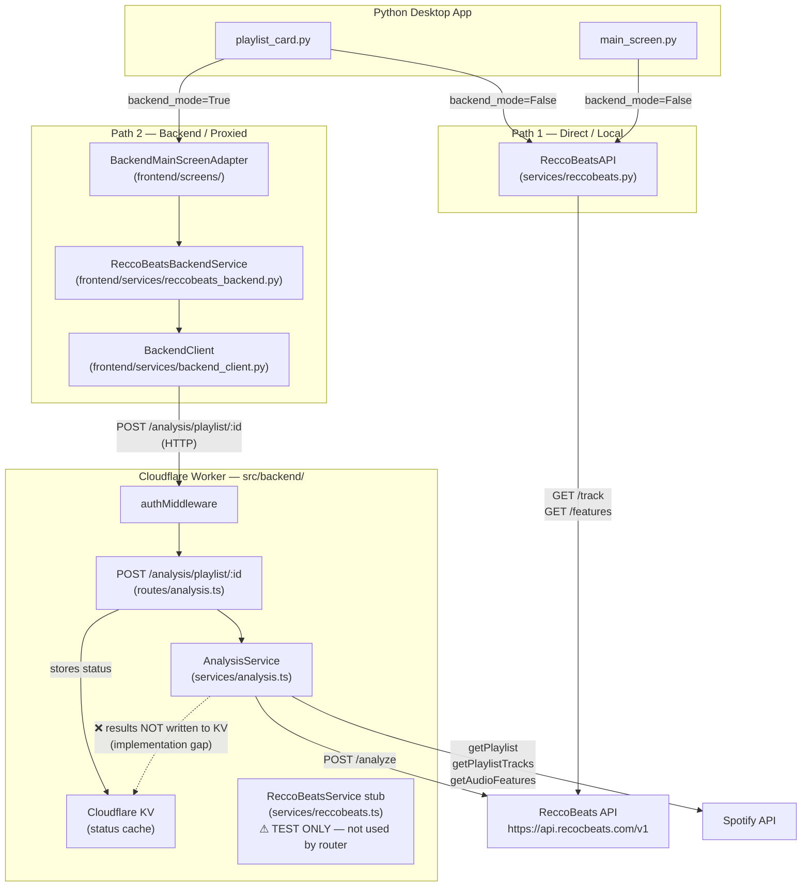

# Backend Analysis Routes

This note explains the TypeScript backend analysis router, how it connects to ReccoBeats, and how it relates to the direct (local) ReccoBeats path that also exists in the Python app.

---

## Open issues and suggested fixes

These are the concrete problems found during research, ordered by impact. Jump to [Known gaps](#known-gaps) at the bottom for a condensed repeat.

### 1. Analysis results are never written to KV — `/results` always returns 404

**File:** [src/backend/routes/analysis.ts](src/backend/routes/analysis.ts)

**Problem:** The `POST /analysis/playlist/:id` handler fires `analyzePlaylist(...)` as a detached promise with only a `.catch()` for failure. The resolved value (the actual ReccoBeats results) is never written to KV.

```ts
// Current (broken) — result is discarded
analysisService.analyzePlaylist(playlistId, userId, jobId).catch(error => { ... });
```

**Fix:** Replace the fire-and-forget with an `await` that saves both the results and a `completed` status:

```ts
// Replace the fire-and-forget block with:
analysisService.analyzePlaylist(playlistId, userId, jobId)
  .then(async (result) => {
    await cacheService.set(`analysis:${playlistId}:${userId}:results`, result, 86400);
    await cacheService.set(statusKey, { ...status, status: 'completed', completed_at: new Date().toISOString() }, 3600);
  })
  .catch(async (error) => {
    console.error('Analysis failed:', error);
    await cacheService.set(statusKey, { ...status, status: 'failed', error: error.message, completed_at: new Date().toISOString() }, 3600);
  });
```

---

### 2. Backend path has two separate cache layers that can go stale independently

**Files:** [src/frontend/caching/backend_cache.py](src/frontend/caching/backend_cache.py), [src/backend/routes/spotify.ts](src/backend/routes/spotify.ts)

**Problem:** When the app is in backend mode, caching happens at two levels:

| Layer | Where | What | TTL |
|---|---|---|---|
| Python local disk | `~/.spotibye/cache/` JSON files | Playlists (1h), tracks (2h), analysis (24h) | Checked first by `BackendCacheManager` |
| Cloudflare KV | Worker-side per-user keys | Playlists (5m), playlist details (10m), tracks (5m), audio features (1h) | Checked by `CacheService` inside the Worker |

The local disk layer TTLs are much longer than KV TTLs, so the Python app can serve a stale 1-hour-old playlist list even though the Worker would have fetched a fresh one from Spotify after 5 minutes.

**Fix options (pick one based on acceptable complexity):**
- **Simple:** Shorten the Python-side `cache_playlists` TTL to match the Worker KV TTL (300s / 5 minutes). Change `ttl: int = 3600` to `ttl: int = 300` in `BackendCacheManager.cache_playlists()`.
- **Better:** Pass `force_refresh=True` from any user-triggered "Refresh" action so the local cache is always bypassed on demand. This already works for playlists (`load_playlists(force_refresh=True)`) and tracks — just ensure the UI refresh button uses it consistently.
- **Best (future):** Have the Worker return a `cache-control` or `x-cache-ttl` header and have the Python client honour it as the local disk TTL instead of hardcoding.

---

### 3. `analyzePlaylist` is synchronous inside a Worker — will hit the 30-second CPU limit

**File:** [src/backend/services/analysis.ts](src/backend/services/analysis.ts)

**Problem:** `analyzePlaylist` fetches Spotify data and calls ReccoBeats entirely inline. Cloudflare Workers have a 30-second wall-clock limit on paid plans (10s on free). A playlist with 100+ tracks calling Spotify's audio-features endpoint and then a ReccoBeats analysis request will exceed this.

**Fix:** Use a [Cloudflare Queue](https://developers.cloudflare.com/queues/) or [Durable Object](https://developers.cloudflare.com/durable-objects/) to move the work out of the request lifecycle. The route handler enqueues a job and returns the job ID; a consumer Worker does the actual Spotify + ReccoBeats work and writes results to KV when done. The existing polling endpoints (`/status`, `/results`) work unchanged.

---

### 4. `ReccoBeatsService` stub in `reccobeats.ts` is dead code in production

**File:** [src/backend/services/reccobeats.ts](src/backend/services/reccobeats.ts)

**Problem:** `ReccoBeatsService.getTrackFeatures()` throws `Error('Reccobeats API not implemented in test environment')` in any non-test environment. It is never imported by the analysis router, so it has no effect. However it will mislead anyone reading the services directory into thinking it is the active ReccoBeats integration.

**Fix options:**
- Delete the file and update any test imports to use the real `AnalysisService` with a mocked `fetch`.
- Or rename it clearly to `reccobeats.mock.ts` and add a comment at the top: `// Test stub only. Live ReccoBeats calls are made via AnalysisService in services/analysis.ts.`

---

### 5. Force-refresh for playlist / track data is available but not wired to all UI paths

**Files:** [src/frontend/screens/backend_main_screen_adapter.py](src/frontend/screens/backend_main_screen_adapter.py), [src/spotify_playlist_exporter_v2/ui/playlist_card.py](src/spotify_playlist_exporter_v2/ui/playlist_card.py)

**Problem:** `load_playlists(force_refresh=True)`, `get_playlist_tracks(force_refresh=True)`, and `refresh_playlist_from_spotify()` all exist and work. In backend mode `main_screen.py` always calls `load_playlists(force_refresh=False)`, so the stale local disk cache is never busted except by TTL expiry.

**Fix:** Ensure any "Refresh" button or pull-to-refresh gesture passes `force_refresh=True`. For the backend path this means calling `backend_adapter.load_playlists(force_refresh=True)` which bypasses the local disk cache and lets the Worker decide whether to hit Spotify or serve from KV.

---

## Two analysis paths

There are **two completely separate code paths** that can perform ReccoBeats analysis, depending on whether the app is running in standalone (local) mode or backend-connected mode.

### Path 1 — Direct / local (Python only)

When `backend_mode_enabled` is `False` (the default for a standalone desktop run), the Python app calls ReccoBeats directly:

- Entry point: `reccobeats_api` in [src/spotify_playlist_exporter_v2/ui/playlist_card.py](src/spotify_playlist_exporter_v2/ui/playlist_card.py#L53)
- Implementation: [src/spotify_playlist_exporter_v2/services/reccobeats.py](src/spotify_playlist_exporter_v2/services/reccobeats.py) — `ReccoBeatsAPI`
- This class makes HTTP requests directly to the ReccoBeats public API (`RECCOBEATS_BASE_URL`) using `requests.Session`.
- Results are cached locally in the persistent on-disk cache.

### Path 2 — Backend / proxied (Python → Cloudflare Worker → ReccoBeats)

When the app is running in backend mode, analysis is proxied through the Cloudflare Worker:

- Entry point: `BackendMainScreenAdapter` in [src/frontend/screens/backend_main_screen_adapter.py](src/frontend/screens/backend_main_screen_adapter.py)
- Python service layer: [src/frontend/services/reccobeats_backend.py](src/frontend/services/reccobeats_backend.py) — `ReccoBeatsBackendService`
- HTTP client: [src/frontend/services/backend_client.py](src/frontend/services/backend_client.py) — `BackendClient` (sends requests to the Cloudflare Worker base URL)
- Worker route: [src/backend/routes/analysis.ts](src/backend/routes/analysis.ts) — `POST /analysis/playlist/:id`
- Worker service: [src/backend/services/analysis.ts](src/backend/services/analysis.ts) — `AnalysisService.analyzePlaylist()`
- `AnalysisService` fetches Spotify data, builds a payload, and POSTs it to `https://api.recocbeats.com/v1/analyze`.

---

## Does the backend support ReccoBeats?

**Yes, the TypeScript backend is wired to call ReccoBeats.** `AnalysisService` in [src/backend/services/analysis.ts](src/backend/services/analysis.ts#L7) has a private `reccoBeatsUrl = 'https://api.recocbeats.com/v1'` and calls `this.callReccoBeatsAPI(analysisData)` with the Spotify track payload.

However, there is a **known implementation gap**: the `POST /analysis/playlist/:id` route fires `analyzePlaylist(...)` as a background fire-and-forget promise but never writes the completed results to KV. The `GET /analysis/playlist/:id/results` endpoint reads from `analysis:{playlistId}:{userId}:results`, which is never written, so it currently always returns `404`.

Summary of backend ReccoBeats status:

| Concern | Status |
|---|---|
| `AnalysisService` calls ReccoBeats API | ✅ Yes |
| Results stored in KV after analysis | ❌ Not yet — implementation gap |
| `/results` endpoint returns real data | ❌ Always 404 until gap is fixed |
| `src/backend/services/reccobeats.ts` used | ❌ No — test stub only, not wired to any route |

The stub at [src/backend/services/reccobeats.ts](src/backend/services/reccobeats.ts) is a test-mode mock. It returns fake features when `ENVIRONMENT === 'test'` and throws in any other mode. It is never imported by the analysis router.

---

## Architecture diagram



---

## Route mount point

The backend registers the analysis router at `/analysis` in [src/backend/index.ts](src/backend/index.ts#L31). Every route in [src/backend/routes/analysis.ts](src/backend/routes/analysis.ts) is exposed under that prefix.

---

## Endpoint map

All routes are behind `authMiddleware`.

### `POST /analysis/playlist/:id`

Starts a new analysis. Stores a `pending` status in KV, then fires `AnalysisService.analyzePlaylist(...)` as a background promise. Returns `processing` immediately so the client can poll.

### `GET /analysis/playlist/:id/status`

Returns the cached status object from `analysis:{playlistId}:{userId}:status`. Used for polling while analysis runs.

### `GET /analysis/playlist/:id/results`

Reads from `analysis:{playlistId}:{userId}:results`. **Currently always 404** because `AnalysisService` does not persist results to that key after completion (see gap above).

### `DELETE /analysis/playlist/:id`

Deletes both the status and results cache keys for the current user and playlist.

---

## Service flow inside `AnalysisService`

Defined in [src/backend/services/analysis.ts](src/backend/services/analysis.ts):

1. Instantiate `SpotifyService` with the user's access token.
2. Fetch playlist metadata (`getPlaylist`).
3. Fetch up to 100 tracks (`getPlaylistTracks`).
4. Fetch Spotify audio features for all track IDs (`getMultipleAudioFeatures`).
5. Build a combined payload with track metadata + audio features.
6. `POST` to `https://api.recocbeats.com/v1/analyze` via `callReccoBeatsAPI(...)`.
7. Return the result object — but the route handler does not write this to KV.

---

## Known gaps

1. **Results never written to KV.** `analyzePlaylist()` returns results but the route handler does not `await` it or save the output. Fix: the `.catch()` error handler in the route should be replaced with a proper `await` that saves results to `analysis:{playlistId}:{userId}:results`.
2. **No Durable Object / Queue.** The comment in `AnalysisService` notes this should use a Durable Object or Queue for true async behaviour. Currently it is fire-and-forget inside a Worker invocation.
3. **`reccobeats.ts` stub has no live path.** `ReccoBeatsService.getTrackFeatures()` throws in non-test environments and is never called by the router. It exists only for unit test scaffolding.
