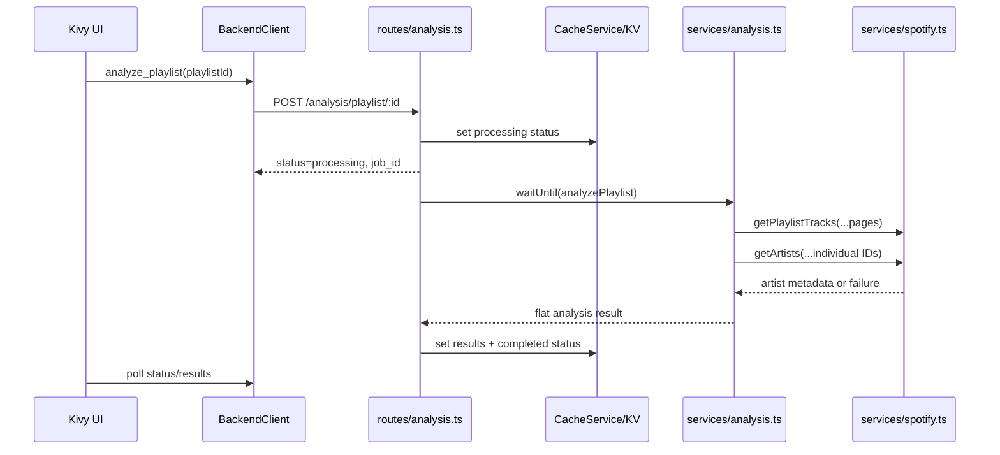

# Backend Analysis Routes

This note explains the current TypeScript backend analysis route and how it relates to the ReccoBeats restoration work.

## Current State

- `POST /analysis/playlist/:id` creates a processing status, starts analysis in `executionCtx.waitUntil(...)`, and returns immediately.
- Completed results are written to KV at `analysis:{playlistId}:{userId}:results`.
- Status is written to KV at `analysis:{playlistId}:{userId}:status`.
- `GET /analysis/playlist/:id/results` returns cached results once analysis completes. It only returns 404 when no result is cached for that playlist/user.
- `src/backend/services/analysis.ts` computes analysis locally from Spotify playlist track metadata and best-effort Spotify artist metadata.
- `src/backend/services/spotify.ts` is the only backend module that calls `api.spotify.com`.
- Artist metadata now uses individual `GET /artists/{id}` requests. The removed Spotify batch endpoint `GET /artists?ids=...` must not be reintroduced.
- Spotify artist `genres` are best-effort because Spotify marks that field deprecated. If artist metadata fails, analysis still completes with an empty `genre_distribution`.

## Backend Flow



## Result Shape

The cached result is a flat object, not nested under `results`:

```json
{
  "job_id": "job-id",
  "playlist_id": "playlist-id",
  "user_id": "user-id",
  "status": "completed",
  "computed_at": "2026-06-19T00:00:00.000Z",
  "completed_at": "2026-06-19T00:00:00.000Z",
  "overview": {
    "total_tracks": 2,
    "total_duration_ms": 360000,
    "average_duration_ms": 180000,
    "formatted_duration": "6m 0s"
  },
  "artists": {
    "unique_artists": 2,
    "diversity": 1,
    "top_artists": [
      { "artist": "Example Artist", "count": 1 }
    ]
  },
  "genre_distribution": {},
  "insights": []
}
```

The frontend still accepts legacy nested responses with `analysis.get("results", analysis)`, but the backend should continue writing the flat canonical shape.

## ReccoBeats Status

Backend-mode playlist analysis does not currently call ReccoBeats. `AnalysisService` still contains a dead `callReccoBeatsAPI()` helper pointing at the suspect `https://api.recocbeats.com/v1/analyze` path, but `analyzePlaylist()` does not call it.

The old `src/backend/services/reccobeats.ts` stub has been deleted. Do not reference it as an active integration point.

Live ReccoBeats wiring is intentionally deferred to [plans/reccobeats-wiring.md](plans/reccobeats-wiring.md), starting with a contract spike. Do not wire `POST /v1/analyze` without verifying the current ReccoBeats API contract.

## Known Gaps

1. **ReccoBeats contract unverified.** Confirm base URL, endpoint paths, identifier type, response shape, auth requirements, and rate-limit behavior before adding live backend calls.
2. **Large playlist hardening deferred.** Current analysis can require many Spotify artist requests. Queue-based hardening remains tracked in the ReccoBeats wiring plan.
3. **Dead helper remains.** `callReccoBeatsAPI()` should be replaced with a verified adapter or deleted after the ReccoBeats contract spike.
