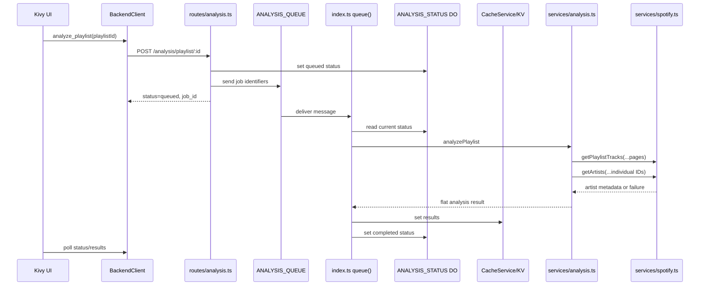

# Backend Analysis Routes

This note explains the current TypeScript backend analysis route and how it relates to the ReccoBeats restoration work.

## Current State

- `POST /analysis/playlist/:id` creates a queued status, sends a message to `ANALYSIS_QUEUE`, and returns immediately.
- The same Worker module exports a queue consumer that loads the session from `SESSIONS_KV`, refreshes the Spotify access token when needed, writes `processing`, and runs `AnalysisService`.
- Completed results are written to KV at `analysis:{playlistId}:{userId}:results`.
- Live status is written to the `ANALYSIS_STATUS` Durable Object named `analysis:{userId}:{playlistId}`.
- Retryable queue failures write `retrying` before rethrowing for Cloudflare Queues retry; exhausted retries write `failed`.
- `GET /analysis/playlist/:id/results` returns cached results once analysis completes. It only returns 404 when no result is cached for that playlist/user.
- `src/backend/services/analysis.ts` computes core analysis from Spotify playlist track metadata and best-effort Spotify artist metadata.
- ReccoBeats audio features are fetched best-effort from `https://api.reccobeats.com/v1/audio-features` using Spotify track IDs and aggregated into `audio_features` when available.
- `src/backend/services/spotify.ts` is the only backend module that calls `api.spotify.com`.
- Artist metadata now uses individual `GET /artists/{id}` requests. The removed Spotify batch endpoint `GET /artists?ids=...` must not be reintroduced.
- Spotify artist `genres` are best-effort because Spotify marks that field deprecated. If artist metadata fails, analysis still completes with an empty `genre_distribution`.

## Backend Flow



## Result Shape

The cached result is a flat object, not nested under `results`:

```json
{
  "job_id": "job-id",
  "playlist_id": "playlist-id",
  "user_id": "user-id",
  "status": "completed",
  "computed_at": "2026-06-19T00:00:00.000Z",
  "completed_at": "2026-06-19T00:00:00.000Z",
  "overview": {
    "total_tracks": 2,
    "total_duration_ms": 360000,
    "average_duration_ms": 180000,
    "formatted_duration": "6m 0s"
  },
  "artists": {
    "unique_artists": 2,
    "diversity": 1,
    "top_artists": [
      { "artist": "Example Artist", "count": 1 }
    ]
  },
  "genre_distribution": {},
  "insights": []
}
```

The frontend still accepts legacy nested responses with `analysis.get("results", analysis)`, but the backend should continue writing the flat canonical shape.

## ReccoBeats Status

Backend-mode playlist analysis now uses ReccoBeats only for stored audio-feature lookup. The verified contract is documented in [reccobeats-api-contract.md](reccobeats-api-contract.md).

The old `src/backend/services/reccobeats.ts` stub has been deleted. Do not reference it as an active integration point.

Do not wire `POST /v1/analyze`; public ReccoBeats docs do not list that endpoint.

## Known Gaps

1. **UI display for audio features deferred.** The backend now returns an `audio_features` summary when ReccoBeats data is available, but the current popup still focuses on duration, genre, and artist sections.
