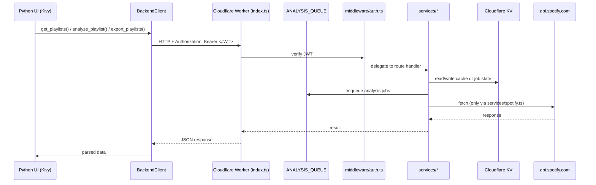
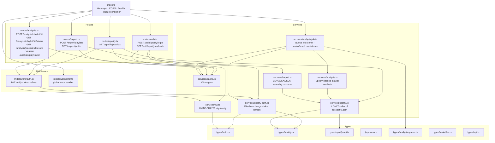

# Code Map

> Definitive file map generated from actual imports starting at `run_frontend_backend.py`.
> Use this to orient quickly in the codebase without reading every file.
> Last updated: 2026-06 (v2 standalone app removed; Mermaid diagram below is stale for the v2 subgraph — see File Index for current frontend layout).

---

## Entrypoint

```
run_frontend_backend.py
  └─ src.frontend.app.SpotifyExporterApp   (re-exported from backend_app.py)
```

The `python -m spotify_playlist_exporter_v2` legacy entrypoint and the `src/spotify_playlist_exporter_v2/` directory have been removed. The backend-integrated path via `run_frontend_backend.py` is the only entrypoint.

---

## Top-Level Module Map

```mermaid
graph TD
    ENTRY["run_frontend_backend.py"]

    subgraph SH ["src/shared/ — shared utilities"]
        SH_LOG["logging_config.py\nlogger"]
        SH_EXC["exceptions.py\nExportError etc."]
    end

    subgraph FE ["src/frontend/ — backend-integrated layer (zero v2 coupling)"]
        APP["app/backend_app.py\nBackendSpotifyExporterApp"]
        AUTH_FE["auth/backend_auth.py\nBackendAuthenticator"]
        LOGIN_FE["auth/backend_login_screen.py\nBackend login UI"]
        CLIENT["services/backend_client.py\nBackendClient (HTTP)"]
        RB_FE["services/reccobeats_backend.py\nReccoBeats via backend"]
        CACHE_FE["caching/backend_cache.py\nBackendCacheManager"]
        CFG["config/backend_config.py\nURLs · flags · timeouts"]
        ADAPTER["screens/backend_main_screen_adapter.py\nBridges MainScreen to backend services"]
        BMS["screens/backend_main_screen.py\nBackendMainScreen"]
        MS["screens/main_screen.py\nMainScreen (backend-only base)"]
        CACHE_EXP_ADAPTER["screens/cache_explorer_adapter.py"]
        SEL["ui/backend_selector_popup.py\nBackend URL picker"]
        CACHE_UI["ui/backend_cache_explorer.py"]
        BCARD["ui/backend_playlist_card.py\nBackendPlaylistCard"]
        FE_CEXP["ui/cache_explorer.py\nCacheExplorerPopup"]
        FE_LAY["ui/layouts.py\nResponsiveGridLayout"]
        STATE["state.py\ncurrent_export_job"]
        PLAT["utils/platform_utils.py\nplatform helpers"]
        NET["utils/network_utils.py\nretry · error helpers"]
    end

    subgraph V2 ["src/spotify_playlist_exporter_v2/ — standalone app (self-contained)"]
        V2_APP["app.py\nSpotifyExporterApp (original)"]
        V2_CFG["config.py"]
        V2_LOG["logging_config.py\n(shim → shared)"]
        V2_STATE["state.py"]
        V2_LOGIN["auth/login_screen.py"]
        V2_HTTP["auth/http_handler.py"]
        V2_MAIN["screens/main_screen.py\nMainScreen (standalone)"]
        V2_RB["services/reccobeats.py\nReccoBeats direct HTTP"]
        V2_PCACHE["caching/persistent_cache.py"]
        V2_TCACHE["caching/track_cache.py"]
        V2_ACACHE["caching/analysis.py"]
        V2_CARD["ui/playlist_card.py"]
        V2_CEXP["ui/cache_explorer.py"]
        V2_IMG["ui/cached_async_image.py"]
        V2_HOVER["ui/hover_manager.py"]
        V2_LAYOUT["ui/layouts.py\n(shim → frontend)"]
        V2_TRACKS["ui/tracks_window.py"]
        V2_PLAT["utils/platform_utils.py\n(shim → frontend)"]
    end

    ENTRY --> APP
    APP --> LOGIN_FE & CLIENT & CACHE_FE & CFG & ADAPTER & BMS & SEL & PLAT & SH_LOG
    AUTH_FE --> CLIENT & CFG
    LOGIN_FE --> AUTH_FE & CLIENT & NET
    CLIENT --> CFG
    RB_FE --> CLIENT & NET
    CACHE_FE --> CFG & CLIENT
    ADAPTER --> CLIENT & RB_FE & CACHE_FE & NET & SH_LOG
    BMS --> MS & BCARD & SH_LOG
    MS --> CFG & STATE & FE_CEXP & FE_LAY & PLAT & SH_LOG & SH_EXC
    CACHE_EXP_ADAPTER --> FE_CEXP & SH_LOG
    SEL --> CFG & CLIENT
    CACHE_UI --> FE_CEXP & SH_LOG
    BCARD --> SH_LOG
    FE_CEXP --> SH_LOG
    FE_LAY --> SH_LOG
    PLAT --> SH_LOG

    V2_APP --> V2_CFG & V2_LOG & V2_STATE & V2_LOGIN & V2_MAIN & V2_PLAT
    V2_LOGIN --> V2_CFG & V2_LOG & V2_STATE & V2_HTTP
    V2_HTTP --> V2_LOG & V2_STATE
    V2_MAIN --> V2_CFG & V2_LOGIN & V2_LOG & V2_RB & V2_STATE & V2_PCACHE & V2_TCACHE & V2_ACACHE & V2_CARD & V2_CEXP
    V2_RB --> V2_CFG & V2_LOG
    V2_PCACHE --> V2_CFG & V2_LOG
    V2_TCACHE --> V2_LOG & V2_PCACHE
    V2_ACACHE --> V2_LOG & V2_STATE & V2_PCACHE
    V2_CARD --> V2_ACACHE & V2_PCACHE & V2_TCACHE & V2_LOG
    V2_CEXP --> V2_PCACHE & V2_TCACHE & V2_LOG
    V2_IMG --> V2_PCACHE & V2_LOG
    V2_TRACKS --> V2_LOG & V2_LOGIN
    V2_LOG --> SH_LOG
    V2_PLAT --> PLAT
    V2_LAYOUT --> FE_LAY
```



---

## HTTP Boundary: Frontend → Backend

The Python frontend never calls Spotify directly. All external API traffic goes through `BackendClient`.



---

## Backend Layer Breakdown



---

## File Index

### src/shared/ — shared utilities (no v2 or frontend dependencies)

| File | Class / Role |
|------|-------------|
| [shared/logging_config.py](../src/shared/logging_config.py) | `logger`, `configure_logging` — used by both frontend and v2 |
| [shared/exceptions.py](../src/shared/exceptions.py) | `ExportError`, `NetworkError`, `ValidationError` etc. |

### src/frontend/ — backend-integrated layer (zero v2 coupling)

| File | Class / Role |
|------|-------------|
| [app/backend_app.py](../src/frontend/app/backend_app.py) | `BackendSpotifyExporterApp` — Kivy MDApp; boot sequence, screen management |
| [app/__init__.py](../src/frontend/app/__init__.py) | re-exports `SpotifyExporterApp` |
| [auth/backend_auth.py](../src/frontend/auth/backend_auth.py) | `BackendAuthenticator` — OAuth callback server, token exchange |
| [auth/backend_login_screen.py](../src/frontend/auth/backend_login_screen.py) | `BackendLoginScreen` — Kivy login UI |
| [services/backend_client.py](../src/frontend/services/backend_client.py) | `BackendClient`, `BackendAPIError` — all HTTP to Cloudflare Worker |
| [services/reccobeats_backend.py](../src/frontend/services/reccobeats_backend.py) | `ReccoBeatsBackendService` — analysis requests via backend |
| [caching/backend_cache.py](../src/frontend/caching/backend_cache.py) | `BackendCacheManager` — disk cache for tokens, jobs, analysis |
| [config/backend_config.py](../src/frontend/config/backend_config.py) | URLs, feature flags, timeouts, `OAUTH_CALLBACK_PORT`, `EXPORT_DIR` |
| [screens/main_screen.py](../src/frontend/screens/main_screen.py) | `MainScreen` — backend-only base screen (no standalone/v2 deps) |
| [screens/backend_main_screen.py](../src/frontend/screens/backend_main_screen.py) | `BackendMainScreen(MainScreen)` — overrides widget factory methods with frontend-native components |
| [screens/backend_main_screen_adapter.py](../src/frontend/screens/backend_main_screen_adapter.py) | `BackendMainScreenAdapter` — bridges `MainScreen` to backend services |
| [screens/cache_explorer_adapter.py](../src/frontend/screens/cache_explorer_adapter.py) | Bridges `CacheExplorer` widget to backend-aware version |
| [ui/backend_selector_popup.py](../src/frontend/ui/backend_selector_popup.py) | `BackendSelectorPopup` — startup URL picker |
| [ui/backend_cache_explorer.py](../src/frontend/ui/backend_cache_explorer.py) | `BackendCacheExplorer` — enhanced cache browser |
| [ui/backend_playlist_card.py](../src/frontend/ui/backend_playlist_card.py) | `BackendPlaylistCard` — playlist card widget (no v2/cache deps) |
| [ui/cache_explorer.py](../src/frontend/ui/cache_explorer.py) | `CacheExplorerPopup` — cache browser popup (data-injection based) |
| [ui/layouts.py](../src/frontend/ui/layouts.py) | `ResponsiveGridLayout` — adaptive grid for playlist cards |
| [state.py](../src/frontend/state.py) | `current_export_job` — global export job state |
| [utils/platform_utils.py](../src/frontend/utils/platform_utils.py) | `diagnose_macos_issues`, `set_window_basics`, `is_mobile_platform` |
| [utils/network_utils.py](../src/frontend/utils/network_utils.py) | Network monitoring, retry decorators, `BackendAPIError` helpers |

### src/spotify_playlist_exporter_v2/ — standalone app (self-contained; no frontend coupling)

| File | Class / Role |
|------|-------------|
| [app.py](../src/spotify_playlist_exporter_v2/app.py) | `SpotifyExporterApp` — original Kivy MDApp (standalone mode) |
| [__main__.py](../src/spotify_playlist_exporter_v2/__main__.py) | CLI entry (`python -m spotify_playlist_exporter_v2`) |
| [config.py](../src/spotify_playlist_exporter_v2/config.py) | OAuth creds, local cache paths, timeouts |
| [logging_config.py](../src/spotify_playlist_exporter_v2/logging_config.py) | **shim** → `src/shared/logging_config.py` |
| [state.py](../src/spotify_playlist_exporter_v2/state.py) | Global export job state (standalone) |
| [auth/login_screen.py](../src/spotify_playlist_exporter_v2/auth/login_screen.py) | `LoginScreen` — Kivy login UI for standalone OAuth |
| [auth/http_handler.py](../src/spotify_playlist_exporter_v2/auth/http_handler.py) | Local HTTP server that handles Spotify OAuth callback |
| [screens/main_screen.py](../src/spotify_playlist_exporter_v2/screens/main_screen.py) | `MainScreen` — full standalone playlist screen (disk cache + ReccoBeats) |
| [services/reccobeats.py](../src/spotify_playlist_exporter_v2/services/reccobeats.py) | `ReccoBeatsAPI` — direct HTTP to ReccoBeats (standalone path only) |
| [caching/persistent_cache.py](../src/spotify_playlist_exporter_v2/caching/persistent_cache.py) | `PersistentCache` — JSON disk cache (`~/.spotibye/cache/`) |
| [caching/track_cache.py](../src/spotify_playlist_exporter_v2/caching/track_cache.py) | Track-level cache helpers |
| [caching/analysis.py](../src/spotify_playlist_exporter_v2/caching/analysis.py) | Analysis task state + cache coordination |
| [ui/playlist_card.py](../src/spotify_playlist_exporter_v2/ui/playlist_card.py) | `PlaylistCard` — card widget; direct ReccoBeats entry point in standalone mode |
| [ui/cache_explorer.py](../src/spotify_playlist_exporter_v2/ui/cache_explorer.py) | `CacheExplorer` — disk cache browser popup |
| [ui/cached_async_image.py](../src/spotify_playlist_exporter_v2/ui/cached_async_image.py) | `CachedAsyncImage` — image loading with disk cache |
| [ui/hover_manager.py](../src/spotify_playlist_exporter_v2/ui/hover_manager.py) | Hover effect state manager |
| [ui/layouts.py](../src/spotify_playlist_exporter_v2/ui/layouts.py) | **shim** → `src/frontend/ui/layouts.py` |
| [ui/tracks_window.py](../src/spotify_playlist_exporter_v2/ui/tracks_window.py) | Track list window |
| [utils/platform_utils.py](../src/spotify_playlist_exporter_v2/utils/platform_utils.py) | **shim** → `src/frontend/utils/platform_utils.py` |

### src/backend/ — Cloudflare Worker (TypeScript)

| File | Class / Role |
|------|-------------|
| [index.ts](../src/backend/index.ts) | Hono app entry — mounts routes, CORS, `/health`, and queue consumer |
| [middleware/auth.ts](../src/backend/middleware/auth.ts) | JWT verification, Spotify token refresh on every authenticated request |
| [middleware/error.ts](../src/backend/middleware/error.ts) | Global error → structured `ErrorResponse` |
| [routes/auth.ts](../src/backend/routes/auth.ts) | `POST /auth/spotify/login`, `GET /auth/spotify/callback` |
| [routes/spotify.ts](../src/backend/routes/spotify.ts) | `GET /spotify/playlists` (KV-cached) |
| [routes/analysis.ts](../src/backend/routes/analysis.ts) | Analysis job lifecycle — writes queued status and sends `ANALYSIS_QUEUE` messages |
| [routes/export.ts](../src/backend/routes/export.ts) | Two-phase resumable export |
| [services/spotify.ts](../src/backend/services/spotify.ts) | **Only** caller of `api.spotify.com` — playlists, tracks, audio features |
| [services/spotify-auth.ts](../src/backend/services/spotify-auth.ts) | OAuth code exchange, token refresh |
| [services/jwt.ts](../src/backend/services/jwt.ts) | HMAC-SHA256 JWT sign/verify (no external library) |
| [services/cache.ts](../src/backend/services/cache.ts) | KV wrapper with namespaced keys |
| [services/analysis.ts](../src/backend/services/analysis.ts) | Computes playlist analysis from Spotify track metadata and best-effort artist metadata |
| [services/analysis-job.ts](../src/backend/services/analysis-job.ts) | Queue job runner — loads/refreshes session token, enforces idempotency, persists status/results |
| [services/export.ts](../src/backend/services/export.ts) | CSV/XLSX/JSON generation, cursor persistence in KV |
| [types/auth.ts](../src/backend/types/auth.ts) | `JWTPayload`, `AuthTokens`, TTL constants |
| [types/spotify.ts](../src/backend/types/spotify.ts) | Spotify response shapes |
| [types/spotify-api.ts](../src/backend/types/spotify-api.ts) | API response schemas, `parseSpotifyResponse()` |
| [types/env.ts](../src/backend/types/env.ts) | Cloudflare `Env` — KV bindings, queue binding, secrets |
| [types/analysis-queue.ts](../src/backend/types/analysis-queue.ts) | Queue message and analysis status record types |
| [types/variables.ts](../src/backend/types/variables.ts) | Hono context variable types |
| [types/api.ts](../src/backend/types/api.ts) | `ErrorResponse` envelope |

---

## Known Dead / Stub Code

None currently. `services/reccobeats.ts` (previously a test stub) has been removed. Analysis is now performed locally by `services/analysis.ts` using Spotify track metadata only.

---

## Analysis: Local Computation (no external API)

`services/analysis.ts` fetches all tracks for a playlist via `services/spotify.ts` and computes stats locally, with best-effort ReccoBeats audio feature enrichment:
- Overview: track count, total duration, average duration
- Artists: unique artist count, top artists by frequency, diversity score
- Genres: best-effort distribution across Spotify artist genre tags
- Audio features: best-effort average ReccoBeats acousticness, danceability, energy, tempo, valence, and related fields
- Insights: generated text summaries

Artist metadata is fetched through individual Spotify `GET /artists/{id}` requests. Do not reintroduce the removed batch endpoint `GET /artists?ids=...`.
ReccoBeats metadata is fetched through `GET https://api.reccobeats.com/v1/audio-features` with repeated Spotify track `ids` query parameters. Do not use the old typo host `api.recocbeats.com` or unverified `POST /v1/analyze`.

`POST /analysis/playlist/:id` writes a queued status and sends a message to `ANALYSIS_QUEUE`. The Worker queue consumer uses `services/analysis-job.ts` to load or refresh the session token, run analysis, and persist results to KV under `analysis:<playlistId>:<userId>:results` once complete. The previously-documented gap (results not written to KV) has been fixed.

The frontend uses `services/reccobeats_backend.py` → `BackendClient` → `POST /analysis/playlist/:id` for the backend-connected analysis path.

---

## Caching: Two Independent Layers

Caching happens at two levels that can drift:

| Layer | Location | TTL (playlists) | What it stores |
|-------|----------|-----------------|----------------|
| Python disk cache | `~/.spotibye/cache/` JSON | 1 hour | Playlists, tracks, analysis |
| Cloudflare KV | Worker-side per-user keys | 5 minutes | Playlists, tracks, audio features |

The Python layer checks first, so a 1-hour stale playlist list can be served even after the Worker would have refreshed from Spotify.
